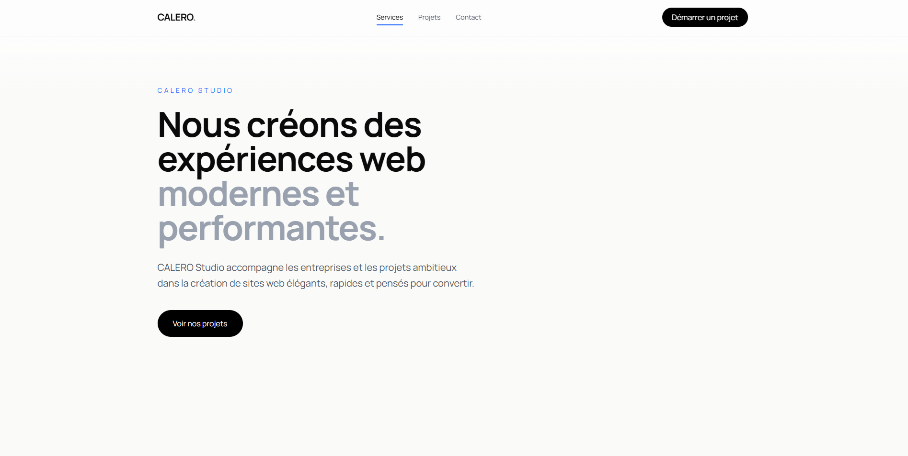

<div align="center">

# Calero Studio

A modern, responsive digital studio website built with Next.js

https://calerostudio.com

<br>

<p>
  
  
  
  

  
</p>

</div>

---

## Preview

<p align="center">
  
</p>

---

## About

Calero Studio is a modern digital studio website built with Next.js.

The project focuses on creating a premium web experience combining minimalist design, performance, responsive architecture and user experience.

Version **1.1.0** introduces a refined brand identity, improved responsive layouts and a functional contact system powered by Resend.

Current version: **1.1.0**

---

## Tech Stack

- Next.js (App Router)
- React
- TypeScript
- Tailwind CSS
- Resend API
- Node.js
- PM2
- Linux VPS

---

## Features

- Responsive design for mobile, tablet and desktop
- Premium minimalist interface
- Modern landing page architecture
- SEO optimized structure
- Fast loading performance
- Smooth reveal animations
- Contact form with email delivery
- Automatic sitemap generation
- Robots.txt configuration
- Production deployment workflow

---

## Version 1.1.0 Updates

### Brand & Design

- Refined CALERO Studio identity
- Improved content consistency across sections
- Updated hero messaging
- Improved mobile experience
- Better spacing and visual hierarchy
- More coherent navigation structure

### Contact System

- Added functional contact form
- Form validation
- Loading states
- Success and error messages
- Email delivery through Resend API
- Custom domain email sending configuration

---

## Performance

- Optimized Next.js rendering
- SEO-friendly structure
- Responsive across all devices
- Optimized image loading
- Production-ready deployment setup

---

## SEO Configuration

### Sitemap

Available at:

```
https://calerostudio.com/sitemap.xml
```

Generated with:

```
src/app/sitemap.ts
```

### Robots.txt

Available at:

```
https://calerostudio.com/robots.txt
```

Generated with:

```
src/app/robots.ts
```

---

## Development

Clone the repository:

```bash
git clone https://github.com/IM-LRC/calero-studio.git
```

Navigate to the project folder:

```bash
cd calero-studio
```

Install dependencies:

```bash
npm install
```

Run development server:

```bash
npm run dev
```

The website will be available at:

```
http://localhost:3000
```

---

## Production Deployment

The website is deployed on a Linux VPS using PM2.

Update production:

```bash
git pull
npm install
npm run build
pm2 restart calero
```

Check application status:

```bash
pm2 list
```

---

## Links

Website:

https://calerostudio.com

Repository:

https://github.com/IM-LRC/calero-studio

---

## License

Private project.

© Calero Studio. All rights reserved.
